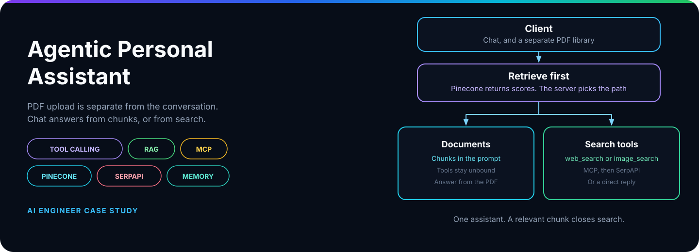
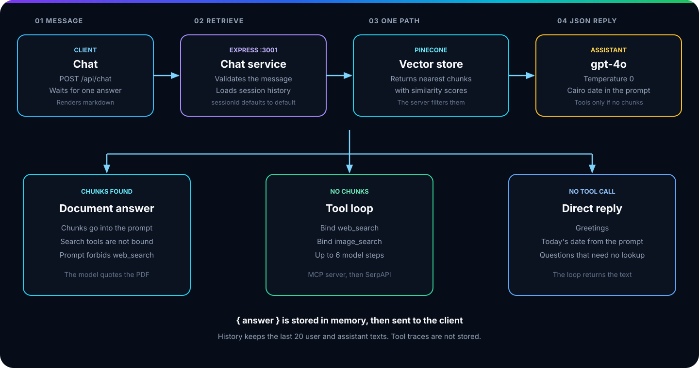
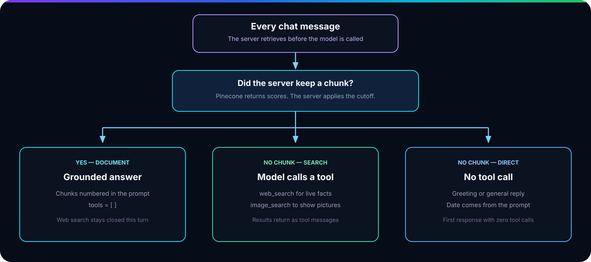
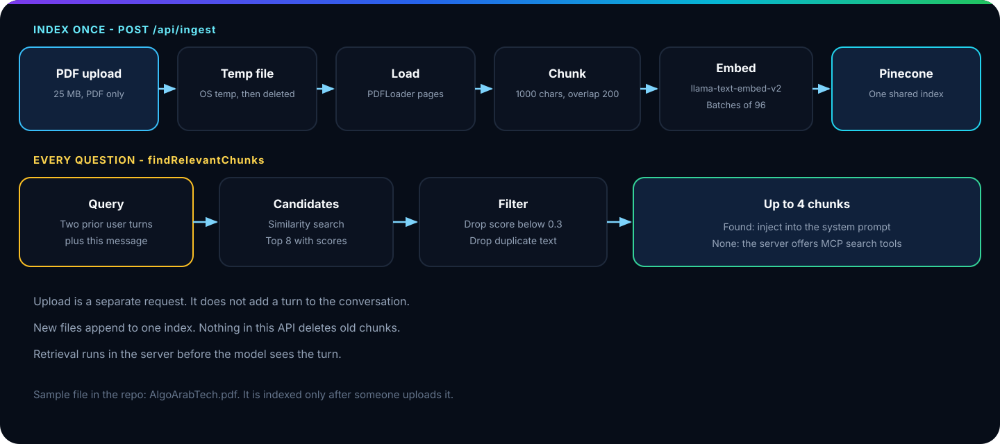
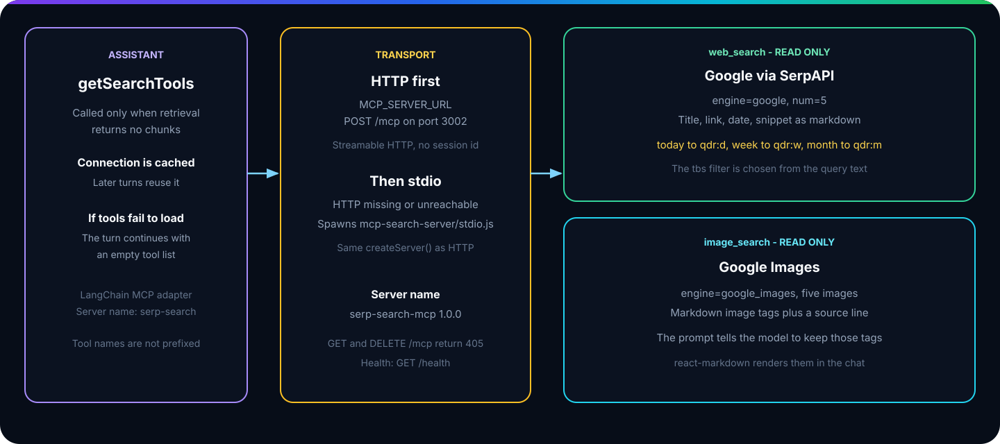
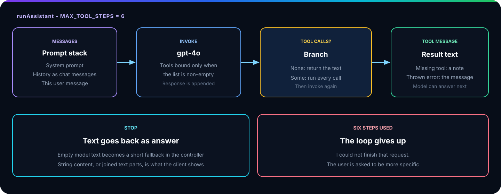
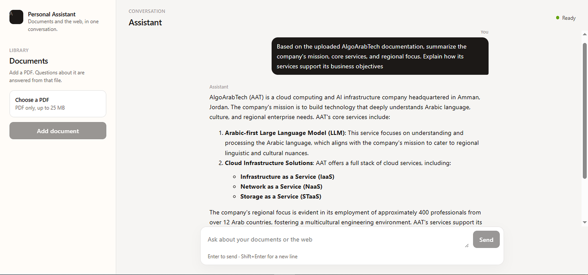
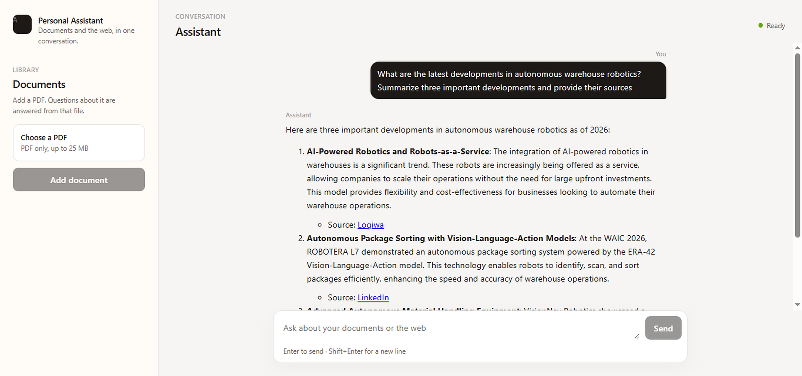
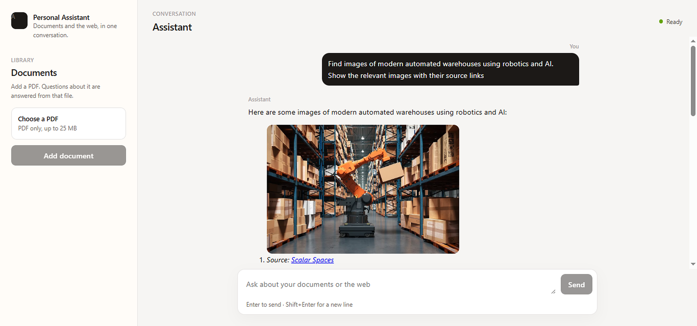
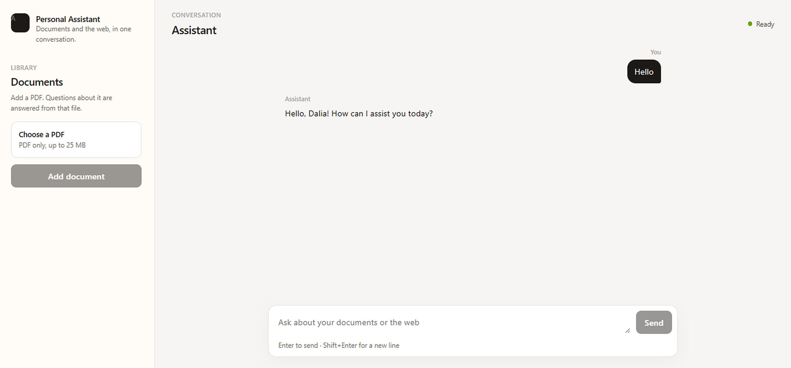

  

<h1 align="center">Personal Assistant</h1>

  <strong>A document library beside the conversation. Questions are answered from indexed chunks, or from the live web and images.</strong>

  
  
  
  

  
  
  

<table align="center" style="margin-left:auto;margin-right:auto">
  <tr>
    <td align="center"><a href="#overview"><b>📋 Overview</b></a></td>
    <td align="center"><a href="#system-architecture"><b>🏗️ Architecture</b></a></td>
    <td align="center"><a href="#how-the-assistant-chooses"><b>🧭 Decision</b></a></td>
  </tr>
  <tr>
    <td align="center"><a href="#rag-pipeline"><b>📚 Documents</b></a></td>
    <td align="center"><a href="#mcp-integration"><b>🔧 MCP</b></a></td>
    <td align="center"><a href="#tool-calling-loop"><b>🔁 Tool loop</b></a></td>
  </tr>
  <tr>
    <td align="center"><a href="#conversation-memory"><b>🧠 Memory</b></a></td>
    <td align="center"><a href="#demo"><b>🎬 Demo</b></a></td>
    <td align="center"><a href="#technology-stack"><b>🧰 Stack</b></a></td>
  </tr>
</table>

## 📋 Overview

Personal Assistant keeps PDF upload separate from the conversation.

The library indexes a file in Pinecone. Chat uses one assistant. Before the model runs, the server queries the index. Pinecone returns similarity scores. The server answers from the chunks it kept, or it offers web and image search.

> Upload fills the library. Chat answers the question. Pinecone does not choose the path.

<table align="center" style="margin-left:auto;margin-right:auto">
  <tr>
    <td width="33%" valign="top">
      <strong>📄 Document library</strong>  
      A PDF is uploaded on its own request. A later question is answered from the chunks the server kept.
    </td>
    <td width="33%" valign="top">
      <strong>🌐 Live web</strong>  
      News, rankings, and prices stay outside the index. <code>web_search</code> asks Google through SerpAPI.
    </td>
    <td width="33%" valign="top">
      <strong>🖼️ Images</strong>  
      <code>image_search</code> returns markdown image tags, and the chat renders them.
    </td>
  </tr>
</table>

## 🏗️ System architecture

<table align="center" style="margin-left:auto;margin-right:auto">
  <tr>
    <th>Part</th>
    <th>Role</th>
    <th>Default address</th>
  </tr>
  <tr>
    <td><code>assistant/client</code></td>
    <td>Conversation, plus a separate PDF library</td>
    <td><code>http://localhost:5173</code></td>
  </tr>
  <tr>
    <td><code>assistant/server</code></td>
    <td>Ingest, retrieval, and the tool loop</td>
    <td><code>http://localhost:3001</code></td>
  </tr>
  <tr>
    <td><code>mcp-search-server</code></td>
    <td><code>web_search</code> and <code>image_search</code></td>
    <td><code>http://localhost:3002/mcp</code></td>
  </tr>
</table>

`POST /api/chat` takes `{ message }` and returns `{ answer }`. `POST /api/ingest` indexes one PDF and does not add a chat turn. `npm run dev:stack` from `assistant` starts all three processes. If `MCP_SERVER_URL` is unset, or HTTP cannot be reached, the API starts the search server over stdio.

## 🧭 How the assistant chooses

`processChat` calls `findRelevantChunks` before `runAssistant`. Pinecone returns scored matches. The server drops scores under 0.3, drops duplicate text, and keeps at most four chunks. Those chunks go into the prompt with an empty tool list. When none are kept, `web_search` and `image_search` are offered, and the model may call one or answer directly. A retrieval error is treated as no chunks.

## 📚 RAG pipeline

### Indexing

The library accepts one PDF, up to 25 MB. `PDFLoader` reads it, and the splitter cuts chunks of 1000 characters with 200 characters of overlap. Embeddings use `llama-text-embed-v2`. Chunks are added in batches of 96 to the index named by `PINECONE_INDEX`. New uploads append. This API does not delete old chunks, and every question searches the whole index. `AlgoArabTech.pdf` is searchable after it is uploaded.

The retrieval query is the current message plus up to two earlier user messages, so a short follow-up can stay on the same file.

## 🔧 MCP integration

Search stays on `mcp-search-server`. The assistant tries streamable HTTP, then stdio, and caches the tool list. If the connection fails, the model answers with no tools. `web_search` can narrow Google to the past day, week, or month when the query asks for that window.

<table align="center" style="margin-left:auto;margin-right:auto">
  <tr>
    <th>Tool</th>
    <th>SerpAPI engine</th>
    <th>Returns</th>
  </tr>
  <tr>
    <td><code>web_search</code></td>
    <td><code>google</code>, five results</td>
    <td>Title, link, optional date, and snippet</td>
  </tr>
  <tr>
    <td><code>image_search</code></td>
    <td><code>google_images</code>, five images</td>
    <td><code></code> and a source line</td>
  </tr>
</table>

## 🔁 Tool-calling loop

`runAssistant` sends the system prompt, prior turns, and the new message. A response with no tool call is the answer. Each call comes back as a `ToolMessage`, and the model is asked again. The loop stops after six steps. On a document turn the tool list is empty, so tools are not bound.

## 🧠 Conversation memory

History is a `Map` in the API process. It stores chat turns, not uploaded files.

<table align="center" style="margin-left:auto;margin-right:auto">
  <tr>
    <th>Rule</th>
    <th>Behavior</th>
  </tr>
  <tr>
    <td>Session key</td>
    <td><code>sessionId</code>, or <code>"default"</code> when the client omits it</td>
  </tr>
  <tr>
    <td>What is stored</td>
    <td>The user text and the final assistant text</td>
  </tr>
  <tr>
    <td>What is left out</td>
    <td>Tool calls, tool results, and PDF uploads</td>
  </tr>
  <tr>
    <td>Cap</td>
    <td>The newest 20 messages, until the API process stops</td>
  </tr>
</table>

The client sends only `message`, so browsers on that server share `"default"`. The date in the prompt comes from `Africa/Cairo` on each request.

## 🎬 Demo

Four turns in the running app. The library stays in the sidebar. Each question takes one path.

<table align="center" style="margin-left:auto;margin-right:auto">
  <tr>
    <td width="50%" valign="top">
      
<strong>Document</strong> Answered from the uploaded AlgoArabTech PDF.

      
    </td>
    <td width="50%" valign="top">
      
<strong>Web</strong> Three current developments, each with a source.

      
    </td>
  </tr>
  <tr>
    <td width="50%" valign="top">
      
<strong>Images</strong> Photos rendered in the reply, with source links.

      
    </td>
    <td width="50%" valign="top">
      
<strong>Direct</strong> A greeting, answered with no search.

      
    </td>
  </tr>
</table>

## 🧰 Technology stack

<table align="center" style="margin-left:auto;margin-right:auto">
  <tr>
    <th>Layer</th>
    <th>Choice</th>
  </tr>
  <tr>
    <td>💬 Client</td>
    <td>React 19, Vite, react-markdown</td>
  </tr>
  <tr>
    <td>⚡ API</td>
    <td>Node.js, Express, Zod, Multer</td>
  </tr>
  <tr>
    <td>🧠 Model</td>
    <td>OpenAI chat, default <code>gpt-4o</code>, temperature 0</td>
  </tr>
  <tr>
    <td>🔁 Orchestration</td>
    <td>One tool-calling loop in <code>runAssistant</code>, six steps maximum</td>
  </tr>
  <tr>
    <td>📚 Retrieval</td>
    <td>PDF load, recursive splitter, Pinecone, <code>llama-text-embed-v2</code></td>
  </tr>
  <tr>
    <td>🔧 Tools</td>
    <td>Model Context Protocol, streamable HTTP with a stdio fallback</td>
  </tr>
  <tr>
    <td>🌐 Search</td>
    <td>SerpAPI Google and Google Images</td>
  </tr>
  <tr>
    <td>🧠 Memory</td>
    <td>In-process map, 20 messages, default session</td>
  </tr>
</table>
